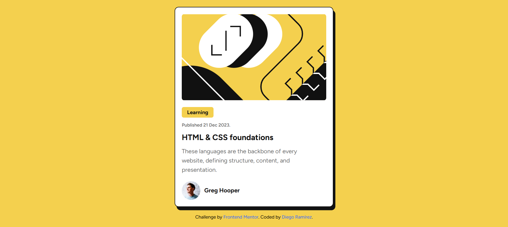

# Frontend Mentor - Blog preview card solution

This is a solution to the [Blog preview card challenge on Frontend Mentor](https://www.frontendmentor.io/challenges/blog-preview-card-ckPaj01IcS). Frontend Mentor challenges help you improve your coding skills by building realistic projects. 

## Table of contents

- [Overview](#overview)
  - [The challenge](#the-challenge)
  - [Screenshot](#screenshot)
  - [Links](#links)
- [My process](#my-process)
  - [Built with](#built-with)
  - [What I learned](#what-i-learned)
  - [Continued development](#continued-development)
- [Author](#author)

## Overview

### The challenge

Users should be able to:

- See hover and focus states for all interactive elements on the page

### Screenshot



### Links

- Solution URL: [Github](https://github.com/Diego2Drm/-Blog-preview-card)
- Live Site URL: [blog-preview-card](https://blog-preview-card-diego-2d.netlify.app/)

## My process

### Built with

- Semantic HTML5 markup
- CSS custom properties
- Flexbox
- Mobile-first workflow
- Tailwind Css
- TypeScript
- [React](https://reactjs.org/) - JS library

### What I learned
I learned use props with TypeScript

To see how you can add code snippets, see below:

```tsx
type infoProps = {
  illustration: string,
  date: string,
  title: string,
  paragraph: string, 
  avatar: string,
  name: string,
}

function Card({ illustration, date, title, paragraph, avatar, name }: infoProps){}
```

### Continued development

-React js + TypeScript

## Author

- Frontend Mentor - [@Diego2Drm](https://www.frontendmentor.io/profile/Diego2Drm)